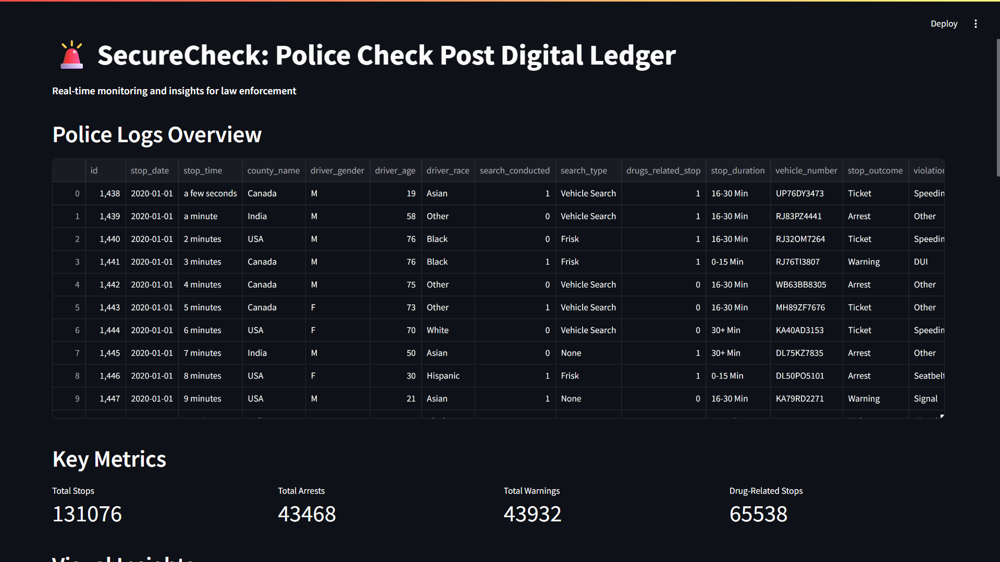
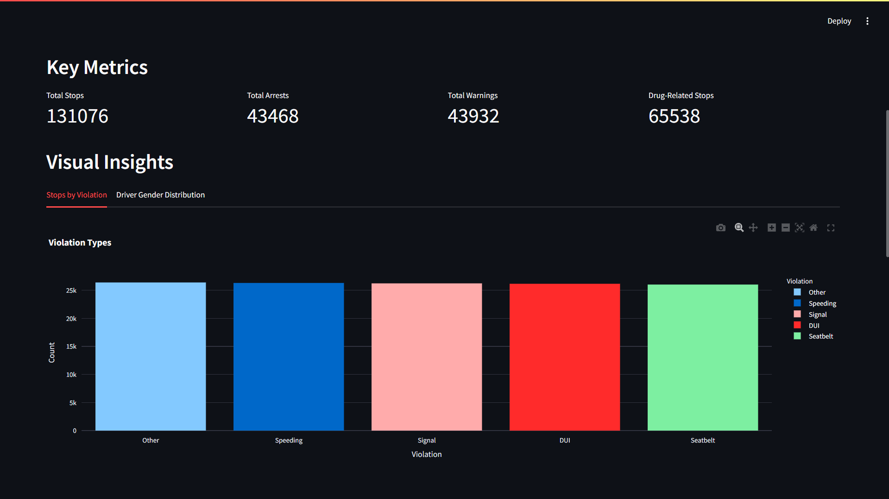
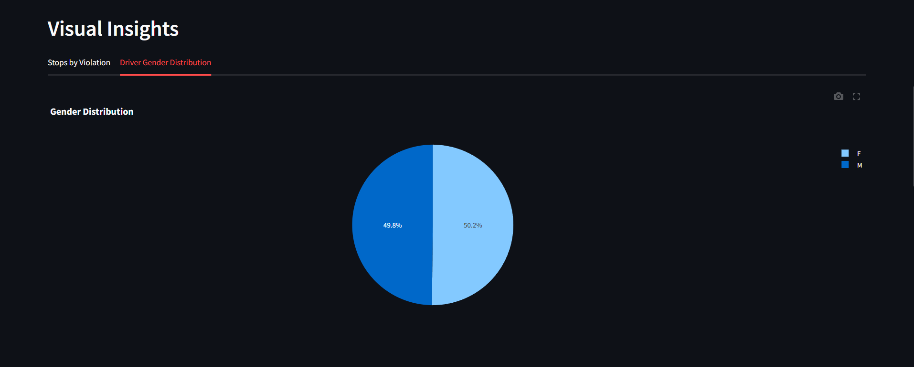
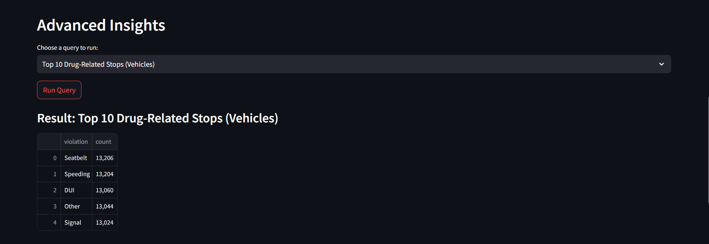
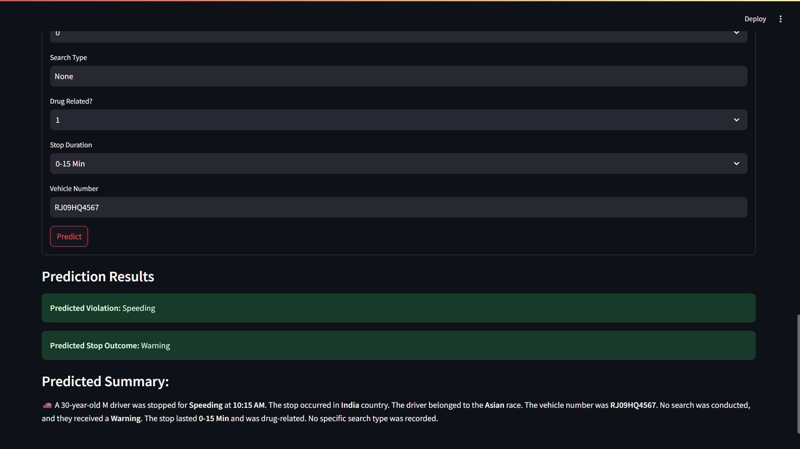

# 🚨 SecureCheck: Police Check Post Digital Ledger

**Real-time monitoring and insights for law enforcement.**

SecureCheck is a police dashboard built using Streamlit and integrated with MySQL for real-time access to police logs. The app allows law enforcement officers to monitor daily activities, analyze key metrics, and gain visual insights from their data.

---

## Table of Contents

- [Overview](#overview)
- [Features](#features)
- [Installation](#installation)
- [Usage](#usage)
- [Dashboard Explanation](#dashboard-explanation)
- [Advanced Queries](#advanced-queries)
- [Predictive Model](#predictive-model)
- [Contributing](#contributing)

---

## Overview

**SecureCheck** is designed to provide law enforcement agencies with real-time access to police logs and an easy way to analyze key data points. With this dashboard, users can:

- View police logs
- Track key metrics (total stops, arrests, warnings, etc.)
- Visualize data insights through interactive charts
- Run advanced SQL queries to extract detailed analytics
- Predict stop outcomes and violations based on historical data

---

## Features

- **Real-Time Monitoring**: Display live data from the police database.
- **Key Metrics**: Track key metrics like total stops, arrests, and drug-related stops.
- **Data Visualizations**: Gain insights into data trends through visual charts.
- **Advanced Queries**: Run custom SQL queries to extract detailed insights.
- **Predictive Model**: Input data for a new stop and predict the outcome and violation type based on historical trends.

---

## 
Follow these steps:
## Installation

To run this app locally, follow these steps:

1. Clone the repository:

    ```bash
    git clone https://github.com/itz-Mayank/SecureCheck.git
    cd SecureCheck
    ```

2. Install required dependencies:

    ```bash
    pip install pip install streamlit pandas mysql numpy
    ```

3. Set up MySQL Database:

    - Make sure you have MySQL installed and running.
    - Create a database called `police` and populate it with your data.

    ```sql
    CREATE DATABASE police;
    ```

    - Update the `create_connection()` function in the code with your database credentials.

4. Run the Streamlit app:

    ```bash
    streamlit run index.py
    ```

---

## Usage

Once the app is running, visit `http://localhost:8501` in your browser.

### **Dashboard Overview**

The main dashboard provides an overview of police logs, key metrics, and data visualizations. Here's a breakdown of the key sections:

### 1. **Police Logs Overview**
   - Displays the entire police log data from the database.
   - If no data is available, a warning message will be shown.

   

### 2. **Key Metrics**
   - **Total Stops**: The total number of police stops recorded.
   - **Total Arrests**: Number of stops leading to arrests.
   - **Total Warnings**: Number of stops leading to warnings.
   - **Drug-Related Stops**: Number of stops where drugs were involved.

### 3. **Data Visualizations**
   - Interactive visualizations for better insights:
     - **Stops by Violation Type**: Bar chart showing the number of stops for each violation type.
     - **Driver Gender Distribution**: Pie chart showing the distribution of drivers by gender.

   

   

### 4. **Advanced Insights**
   - Use the dropdown to run different SQL queries and get in-depth analysis of the police logs data. Examples of queries:
     - Count of stops by violation type
     - Number of arrests vs. warnings
     - Most common violations for arrests

   

---

## Dashboard Explanation

### **Predictive Model**

SecureCheck includes a form where users can input data for a new stop (e.g., stop time, country, driver age, gender, etc.) and predict the stop outcome and violation type based on historical data.

- The form includes the following fields:
  - Stop Date & Time
  - Country Name
  - Driver Information (Age, Gender, Race)
  - Search Conducted & Search Type
  - Drug-Related Stop
  - Stop Duration
  - Vehicle Number

Once the form is submitted, the app predicts the most likely violation and stop outcome, based on the existing dataset.

### **Prediction Summary**

After submitting the form, users receive a summary of the predicted stop, including:
- Predicted violation type
- Predicted stop outcome
- A textual summary of the predicted scenario



---

## Advanced Queries

The app also supports running advanced SQL queries directly from the dashboard. Examples of available queries include:

1. **Total Number of Police Stops**
2. **Count of Stops by Violation Type**
3. **Arrests vs. Warnings**
4. **Average Age of Drivers Stopped**
5. **Most Frequent Search Types**

These queries help to extract detailed insights and analytics from the police logs database.

---

## Contributing

Feel free to fork the repository, create pull requests, and help improve this project!

---


